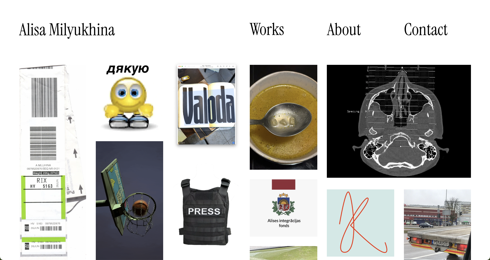
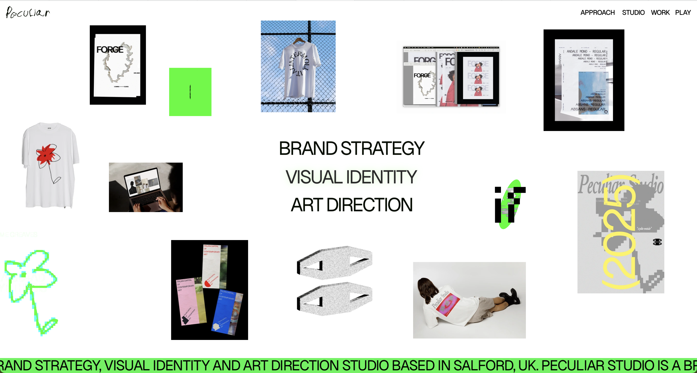
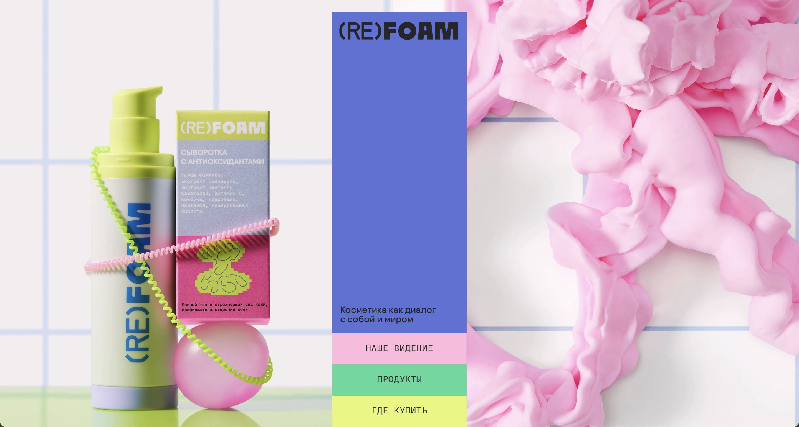
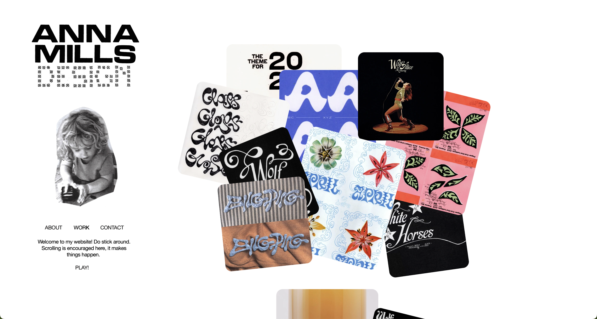
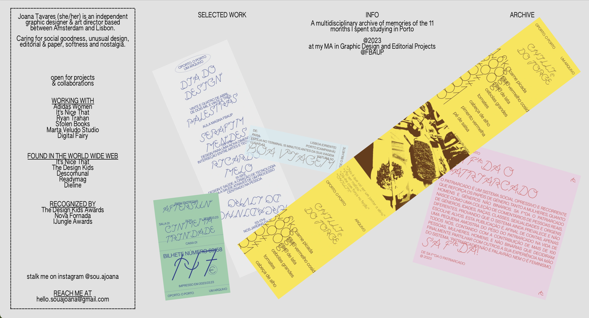
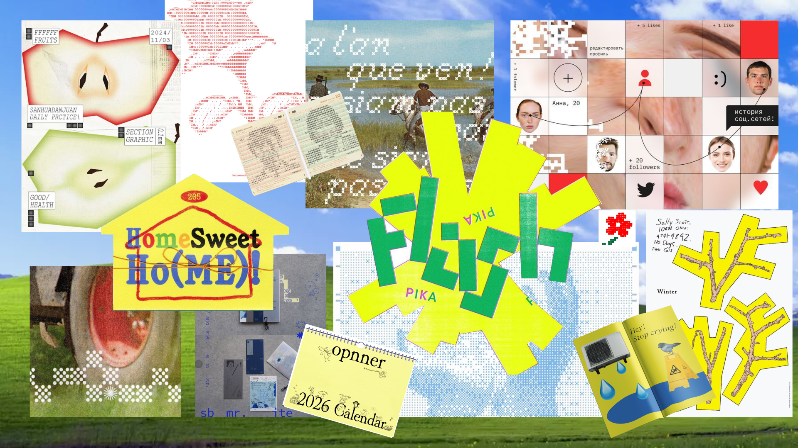

# final_web

## 🎯 OBJETIVO GENERAL 
Exponer mis proyectos de diseño de forma visual e interactiva, generando una experiencia que refleje mi estilo personal. 
  
## 👤 PROTOPERSONAS

### Usuario extremo 1: El reclutador profesional 

| *Nombre y sketch*        | *Comportamientos y creencias*|
| :---------------------------- | :-------------------------- |
| Reclutador profesional: Representa a quien busca talento para contratar. Observa mi portafolio desde una mirada técnica y estratégica.     | Navega rápido, comparando varios portafolios a la vez. Se enfoca en consistencia visual y organización de contenido. El diseño debe comunicar claridad. |
|*Demografía*        | *Necesidades y metas*|
| Persona adulta, con experiencia laboral en diseño o comunicación digital, ubicada en un entorno profesional.      | Quiere identificar mi estilo, competencias y forma de pensar el diseño. Evalúa si el trabajo demuestra compromiso, criterio y originalidad. Desea reconocer mi potencial como futura colaboradora. |    

___

### Usuario extremo 2: Mente creativa en movimiento 

| *Nombre y sketch*        | *Comportamientos y creencias*|
| :---------------------------- | :-------------------------- |
| Representa a profesionales del diseño que trabajan en industrias altamente dinámicas como packaging, branding, K-pop, juguetes o visualización de datos, donde confluyen la estética, los medios digitales y la innovación visual. | Cree que el diseño debe ir reinventándose, dialogar con tendencias culturales y que es una herramienta para traducir ideas en experiencias visuales tecnológicas.|
| *Demografía*        | *Necesidades y metas*|
| Persona creativa, japonés o coreano de un entorno competitivo, que trabaja en equipos interdisciplinarios de diseño gráfico, industrial o comunicación visual. | Encontrar inspiración y nuevas aproximaciones visuales. Percibir una propuesta fresca, adaptable y visualmente sólida. Descubrir propuestas visuales que conecten creatividad y tecnología. |

___

  ### Usuario Promedio: Navegante creativo 

| *Nombre y sketch*        | *Comportamientos y creencias*|
| :---------------------------- | :-------------------------- |
| Representa a personas curiosas e interesadas en el diseño visual, digital o artístico que llegan a mi portafolio buscando inspiración o referencias. | Navega portafolios para inspirarse visualmente o descubrir nuevas estéticas. Creen que el diseño comunica identidad y experimentación. |
| *Demografía*        | *Necesidades y metas*|
| Personas jóvenes o adultas, vinculadas a disciplinas creativas como diseño, música, juegos, tecnología, que exploran contenido en internet y redes. | Quieren inspirarse con mi lenguaje visual, composición y uso de medios digitales. Reconocer en mi portafolio una voz creativa auténtica y estimulante. |

___

### 📌 ANTECEDENTES 

(Por alguna razón la única página que funciona es la 2, ya que aparece el error 403 forbidden que según internet no se puede hacer nada ya que no depende de mí :_( intenté hacer de todo) 
<table>
  <tr>
    <td valign="top"  align="center" width="50%">
        
    </td>
    <td valign="top" width="50%">
        
    </td>
  </tr>
  <tr>
    <td valign="top" width="33%">
      <b>¿Qué es?</b>  Portafolio digital que presenta una identidad visual muy personal y auténtica. Combina investigación histórica con una estética contemporánea, lo que resulta en un portafolio íntimo y reflexivo que transmite sus valores, su proceso creativo y su vínculo con la cultura visual.  
      <b>Fuente:</b> <a href="/alisamilyukhina.com/">Alisa Milyukhina</a> 
      <b>✅:</b> Desde el primer momento te permite conocer a la creadora ya que muestra su personalidad, sus intereses y su perspectiva como diseñadora. Eso crea una conexión más profunda con el visitante, porque no solo se ven sus proyectos, sino quién hay detrás. 
      <b>❌:</b> Para un usuario que está evaluando para contratar como un reclutador, es posible que no tenga tanto interés en conocer el perfil personal profundo. Probablemente quiera ver rápido los proyectos, la experiencia y resultados, y puede que se frene si la presentación es demasiado personal o lenta para ese fin.
    </td>
    <td valign="top" width="33%">
      <b>¿Qué es?</b>  Portafolio digital experimental muy personal y creativo. Con una estética tipo “cuaderno visual”, con elementos flotantes, capas, animaciones sutiles y una sensación de espacio íntimo. Según una entrevista, su web fue pensada como un “playground” para expresar su personalidad y su proceso creativo. 
      <b>Fuente:</b> <a href="https://luoooif.com">Luoooif</a> 
      <b>✅:</b> Es muy creativo y no convencional, con composición libre, elementos interactivos y una estructura que refleja su identidad como diseñadora. Además muestra gran cantidad de trabajo lo que permite versatilidad.  
      <b>❌:</b> La navegación puede ser un poco confusa o difícil de usar ya que la prioridad parece haber sido el diseño como experiencia sobre la usabilidad, por lo que puede no ser obvio dónde hacer clic para avanzar o cómo moverse entre secciones.
    </td>
  </tr>
  </table>

<table>
  <tr>
    <td valign="top"  align="center" width="50%">
        
    </td>
    <td valign="top" width="50%">
        
    </td>
  </tr>
  <tr>
    <td valign="top" width="33%">
      <b>¿Qué es?</b>  Sitio web de Peculiar Studio. Enfoque fuerte en la interacción y la dirección de arte. Portafolio moderno que mezcla diseño, color y tipografía de forma creativa para mostrar sus capacidades de branding, estrategia visual y dirección creativa. 
      <b>Fuente:</b> <a href="https://peculiar.studio">Peculiar Studio</a> 
      <b>✅:</b> La sección PLAY es altamente interactiva, lo que hace que la experiencia sea lúdica y atractiva. El uso de colores vibrantes y tipografías de mi gusto refuerza su estilo personal y hace que la navegación visual sea muy distintiva.  
      <b>❌:</b> La página principal no tiene un impacto tan potente, ya que para ver sus trabajos se debe hacer hover sobre una palabra, lo que puede ser poco intuitivo para algunos usuarios. 
    </td>
    <td valign="top" width="33%">
      <b>¿Qué es?</b>  Página de productos de Re-Foam. Diseño moderno e interactivo. Hay transiciones suaves, bloques de contenido que aparecen por secciones y una composición que mezcla tipografía llamativa con fotografías de sus productos. 
      <b>Fuente:</b> <a href="https://re-foam.ru">Re-Foam</a> 
      <b>✅:</b> La interacción principal del scroll para general una línea de tiempo visual en el centro de la página es muy llamativa, ya que señala la sección de la página donde te encuentras y guía la exploración de los productos de forma dinámica.  
      <b>❌:</b> La paleta de colores es tan amplia que puede generar distracción ya que con tantos colores, es difícil saber dónde poner el foco visual y qué parte del contenido es más importante. Esta densidad visual puede afectar la legibilidad o la claridad.
    </td>
  </tr>
  </table>

  <table>
  <tr>
    <td valign="top"  align="center" width="50%">
        
    </td>
    <td valign="top" width="50%">
        
    </td>
  </tr>
  <tr>
    <td valign="top" width="33%">
      <b>¿Qué es?</b>  Portafolio digital que abre con una composición de imágenes que actúan como una introducción visual a su estilo, y luego continúa con una disposición vertical en la que los trabajos se presentan uno tras otro en un único recorrido continuo. Cada proyecto aparece acompañado de capturas o visuales sin demasiado texto, priorizando la estética y la secuencia narrativa antes que las descripciones detalladas. El diseño tiene un enfoque muy simple y directo, sin menú principal ni secciones separadas, lo que genera una lectura más contemplativa y basada en el scrolleo. La interfaz apuesta por lo visual como eje central y evita los elementos tradicionales de navegación. 
      <b>Fuente:</b> <a href="https://annamills.xyz/4/">Anna Mills</a> 
      <b>✅:</b> Tiene alta interactividad ya que las imágenes movibles en la página principal hacen que la experiencia sea más atractiva y viva. Su estructura constante de datos a la izquierda y proyectos a la derecha permite mantener la info personal visible a todo momento, lo que genera conexión y refuerza la marca personal. Su secuencia narrativa hace una experiencia mucho más contemplativa.   
      <b>❌:</b> Falta índice o resumen de proyectos, no hay una lista clara o presentación de los proyectos, lo que obliga a hacer scroll hasta abajo para ver qué ha hecho y no da contexto de qué tratan.
    </td>
    <td valign="top" width="33%">
      <b>¿Qué es?</b>  Portafolio digital limpio y minimalista. En su página principal se muestran sus proyectos gráficos de forma fiel a sus formatos originales, sin recortarlos ni redimensionarlos para encajar en una cuadrícula rígida. Además, se presenta una sección de información personal junto a los proyectos, lo que da un contexto profesional y permite entender quién está detrás del trabajo. 
      <b>Fuente:</b> <a href="https://souajoana.com/oportooporto/">Joana Tavares</a> 
      <b>✅:</b> Preserva los formatos originales de sus proyectos, lo cual respeta la integridad de cada pieza y permite apreciar detalles que podrían perderse si se adaptaran a un layout estándar. 
      <b>❌:</b> El color de fondo resulta poco llamativo, lo que puede hacer que el sitio se vea muy sobrio o apagado. Además, su cuadro de información personal (a la izquierda) tiene mucho texto y no atrae tanto al lector; puede pasar desapercibido o no invitar a leer en profundidad.
    </td>
  </tr>
  </table>

### 📌 REFERENTES

 

